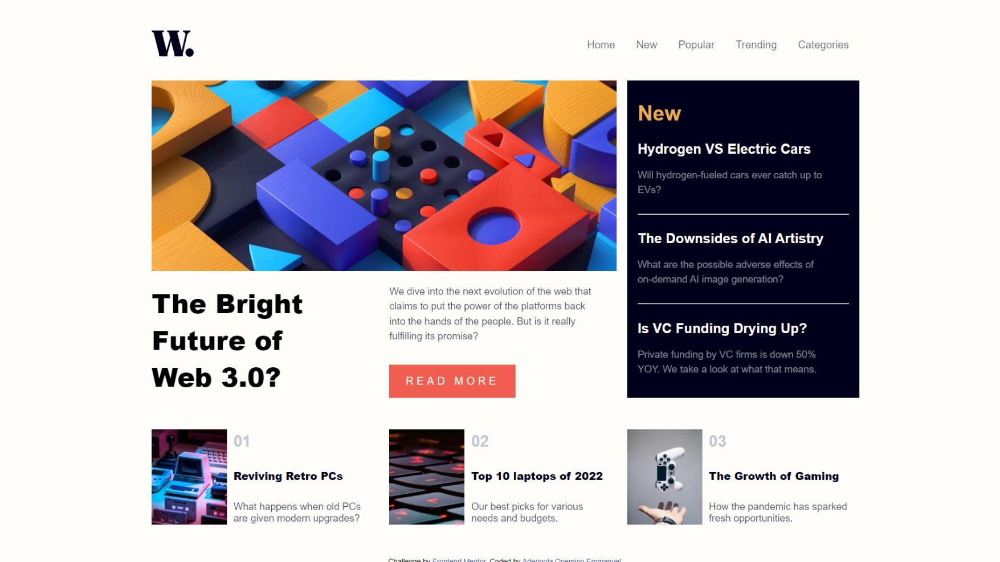

# Frontend Mentor - News homepage solution

This is a solution to the [News homepage challenge on Frontend Mentor](https://www.frontendmentor.io/challenges/news-homepage-H6SWTa1MFl). Frontend Mentor challenges help you improve your coding skills by building realistic projects. 

## Table of contents

- [Overview](#overview)
  - [The challenge](#the-challenge)
  - [Screenshot](#screenshot)
  - [Links](#links)
- [My process](#my-process)
  - [Built with](#built-with)
  - [Continued development](#continued-development)
- [Author](#author)

## Overview
  This is a challenge to test your skill of judgement and precision as well as your right usage of semantics.
  It is a basic news homepage with a navigation bar of navigation links and a body section made up of containers and links to different news articles
### The challenge

Users should be able to:

- View the optimal layout for the interface depending on their device's screen size
- See hover and focus states for all interactive elements on the page

### Screenshot

### Links

- Solution URL: (https://github.com/Oppy09/news-homepage-main)
- Live Site URL: (https://oppy09.github.io/news-homepage-main/)

## My process
  I started by writing out my html code working from top to bottom depending on how the elements are aligned and their requirements 
  Then i styled my contents based on the design provided
  I focused on the interactive and focus states of some elements
  I worked on the responsiveness of the design
  Finally, i wrote the javascript code for the mobile version of the navigation bar
### Built with

- Semantic HTML5 markup
- CSS custom properties
- Flexbox
- CSS Grid
- Desktop-first workflow
- [jQuery](https://jquery.com) - JS library

### Continued development

  I still want to focus on making the mobile version of navigation bar look as close to the design as possible as well as how to create navigation links with dropdown menu

## Author
- Frontend Mentor - [@Oppy09] (https://www.frontendmentor.io/profile/Oppy09)
- Twitter - [@AderinolaOpemi5] (https://www.twitter.com/AderinolaOpemi5)